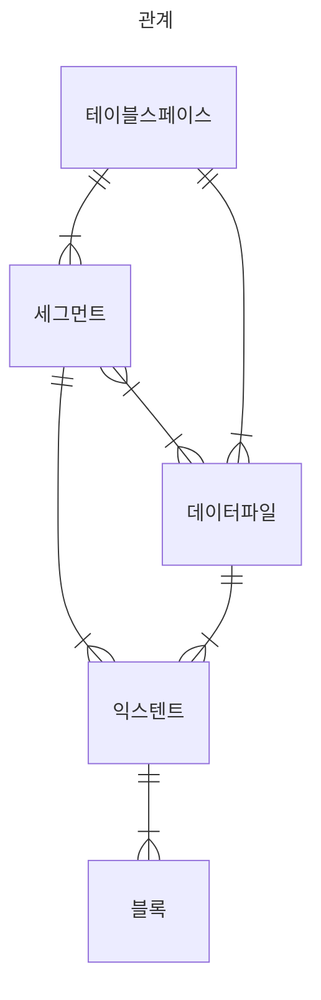

# 1. SQL 처리 과정과 I/O

- [SQL 최적화](#sql-최적화)
  - [SQL 최적화 과정](#sql-최적화-과정)
- [SQL 옵티마이저](#sql-옵티마이저)
- [실행계획과 비용](#실행계획과-비용)
  - [TYPE 종류](#-type-종류)
- [옵티마이저 힌트](#옵티마이저-힌트)
- [소프트 파싱 vs 하드 파싱](#소프트-파싱-vs-하드-파싱)
- [바인드 변수의 중요성](#바인드-변수의-중요성)
- [데이터베이스 저장 구조](#데이터베이스-저장-구조)
- [DBA (Data Block Address)](#dba-data-block-address)
- [시퀀셜 액세스 VS 랜덤 엑세스](#시퀀셜-액세스-vs-랜덤-엑세스)
- [논리적 I/O VS 물리적 I/O](#논리적-io-vs-물리적-io)
  - [버퍼캐시 히트율 (BCHR)](#버퍼캐시-히트율-bchr)
- [Single Block I/O VS Multiblock I/O](#single-block-io-vs-multiblock-io)
- [Table Full Scan VS Index Range Scan](#table-full-scan-vs-index-range-scan)
- [캐시 탐색 메커니즘](#캐시-탐색-메커니즘)
  - [래치 (Latch)](#래치-latch)
  - [버퍼 Lock](#버퍼-lock)

***
 
## 1. SQL 파싱과 최적화

### SQL 최적화
- DBMS 내부에서 프로시저를 작성하고 컴하일해서 실행 가능한 상태로 만드는 전 과정

#### SQL 최적화 과정

> 1. SQL 파싱
> - 파싱 트리 생성
> - Syntax 체크
> - Semantic 체크
> 2. SQL 최적화
> - [SQL 옵티마이저](#sql-옵티마이저)가 수행
> 3. 로우 소스 생성
> - 옵티마이저가 선택한 실행경로를 실제 실행 가능한 코드 or 프로시저 형태로 포맷팅하는 단계
> - Row-Source Generator 에서 담당


### SQL 옵티마이저
- 사용자가 원하는 작업을 가장 효율적으로 수행할 수 있는 최적의 데이터 액세스 경로를 선택해 주는 DBMS 의 핵심 엔진

### 실행계획과 비용
- DBMS에서 SQL 실행경로를 미리볼 수 있음

> ✅ MySQL 의 경우 쿼리문 앞에 `EXPLAIN` 을 붙이면 확인 가능함


- `table` : 조회한 테이블 명
- `type` : 테이블을 어떤 방식으로 조회했는지
- `possible_keys` : 사용 가능한 인덱스 목록
- `key` : `possible_keys` 목록 중 실제로 사용한 인덱스
- `ref` : 테이블을 조인할 때 어떤 기준으로 조인을 했는지
- `rows` : sql문 수행을 위해서 테이블에 접근한 데이터의 개수 데이터의 액세스 수
- 등등...

***
#### ✏️ TYPE 종류

`ALL`
- Full Table 스캔
- 인덱스를 활용하지 않고 **테이블을 처음부터 끝까지 전부 다 뒤져서** 데이터를 찾는 방식

`index`
- Full Index 스캔
- **인덱스 테이블을 처음부터 끝까지 다 뒤져서** 데이터를 찾는 방식
- 인덱스의 테이블은 실제 테이블보다 크기가 작기 때문에, _풀 테이블 스캔(Full Table Scan)보다 효율적_

`const`
- 1건의 데이터를 바로 찾을 수 있는 경우
- 인덱스가 걸려있고 `UNIQUE` 한 데이터 1건을 찾는 경우에 적용됨 
  - 고유 인덱스와 기본 키는 전부 UNIQUE한 특성을 가지고 있음

> ✅ UNIQUE 속성을 가진 컬럼은 인덱스가 자동으로 생성됨! == **고유 인덱스**

`ref`
- 고유 인덱스를 사용한 경우 (= UNIQUE가 아닌 컬럼의 인덱스를 사용한 경우) type에 ref가 출력됨


그외
- `eq_ref`, `index_merge`, `ref_or_null`
***

### 옵티마이저 힌트
- 주석 기호에 '+' 붙이기

```SQL
SELECT /*+ INDEX(A 고객_PK) */
    고객명, 연락처, 주소, 가입일시
FROM 고객 A
WHERE 고객ID = '000008'
```

#### 주의 사항
- ',' 는 힌트와 힌트 사이에 사용하면 안됨
- FROM 절 테이블명 앞에 ALIAS를 지정했다면, 힌트에도 반드시 ALIAS를 사용해야 함
- 테이블을 지정할 때 스키마명은 명시하면 안됨

&nbsp;
***

## 2. SQL 공유 및 재사용

### 소프트 파싱 vs 하드 파싱


- 소프트 파싱 : SQL을 캐시에서 찾아 곧바로 실행단계로 넘어가는 것
- 하드 파싱 : SQL을 캐시에서 찾는 데 실패해  최적화 및 로우 소스 생성 단계까지 모두 거치는 것


### 바인드 변수의 중요성

```SQL
SELECT * FROM CUSTOMER WHERE LOGIN_ID = 'oraking'
```
- 로그인 아이디가 달라지는대로 SQL 이 모두 [라이브러리 캐시](#라이브러리-캐시)에 저장될 것
  - **SQL은 이름이 따로 없고 SQL 자체가 이름이기 때문**

#### 바인드 변수 사용 시
```SQL
SELECT * FROM CUSTOMER WHERE LOGIN_ID = ?
```
- 로그인ID를 파라미터로 받는 프로시저 하나를 공유하면서 재사용이 가능해짐

&nbsp;

#### 라이브러리 캐시
- SQL 파싱, 최적화, 로우 소스 생성 과정을 거쳐 생성한 내부 프로시저를 반복 재사용할 수 있도록 캐싱해 두느 메모리 공간
- [SGA (System Global Area)](https://en.wikipedia.org/wiki/System_Global_Area) 구성요소

&nbsp;
***

## 3. 데이터 저장 구조 및 I/O 메커니즘

디스크 I/O 가 SQL 성능을 좌우함


### 데이터베이스 저장 구조

- `블록` : 데이터를 읽고 쓰는 단위
  - 한 블록에 저장된 레코드는 모둑 ㅏㅌ은 테이블 레코드임
- `익스텐트` : 공간을 확장하는 단위. 연속된 블록 집합
- `세그먼트` : 데이터 저장공간이 필요한 오브젝트
  - 테이블, 인덱스, 파티션, LOB 등
- `테이블스페이스` : 세그먼트를 담는 콘테이너
- `데이터파일` : 디스크 상의 물리적인 OS 파일



> #### DBA (Data Block Address)
> 디스크 상에서 몇 번 데이터 파일의 몇 번째 블록인지를 나타내는 자신만의 고유 주소값
> ROWID = DBA + ROW 번호

&nbsp;

### 시퀀셜 액세스 VS 랜덤 엑세스

#### 시퀀셜 액세스
- 논리적 or 물리적으로 연결된 순서에 따라 차례대로 블록을 읽는 방식

#### 랜덤 액세스
- 레코드 하나를 읽기 위해 한 블록씩 접근하는 방식

&nbsp;

### 논리적 I/O VS 물리적 I/O

#### DB 버퍼캐시
- SGA의 가장 중요한 구성요소 중 하나
- '데이터 캐시' (↔️↔ 라이브러리 캐시는 '코드 캐시')

#### 논리적 I/O
- SQL을 처리하는 과정에 발생한 총 블록 I/O
- Direct Path I/O 를 제외하면 모든 I/O 는 버퍼 캐시를 경유하므로 메모리 I/O = 논리적 I/O

#### 물리적 I/O
- 디스크에서 발생한 총 블록 I/O
- 논리적 블록 I/O 중 일부를 물리적으로 I/O함
  - 버퍼캐시에서 찾지 못할 때만 디스크를 액세스하므로

#### 버퍼캐시 히트율 (BCHR)

$$
\begin{equation}
BCHR = (캐시에서 곧바로 찾은 블록 수 / 총 읽은 블록 수) * 100
= (1 - (물리적 I/O) / (논리적 I/O) * 100
\end{equation}
$$

- 읽은 전체 블록 중에서 물리적인 디스크 I/O 를 수반하지 않고 곧바로 메모리에서 찾은 비율을 나타냄

&nbsp;

### Single Block I/O VS Multiblock I/O

#### Single Block I/O
- 한 번에 한 블록씩 요청해서 메모리에 적재하는 방식

#### Multiblock I/O
- 한 번에 여러 블록씩 요청해서 메모리에 적재하는 방식
- 같은 익스텐트에 속하는 인접 블록만 적재 가능함

&nbsp;

### Table Full Scan VS Index Range Scan

#### Table Full Scan
- 테이블에 속한 블록 '전체'를 읽어서 사용자가 원하는 데이터를 찾음
- **시퀄셜 액세스** + **Multiblock I/O** 방식 사용

#### Index Range Scan
- 인덱스에서 '일정량'을 스캔하면서 얻은 `ROWID`로 테이블 레코드를 찾아가는 방식
- `ROWID` : 테이블 레코드가 디스크 상에 어디 저장 됐는지를 가리키는 위치 정보
- **랜덤 액세스** + **Single Block I/O** 방식 사용

> 🤨**읽을 데이터가 일정량을 넘으면** 인덱스보다 **Table Full Scan**이 유리함
> e.g.) 인덱스를 이용해 전체 레코드를 액세스하는 경우에는 모든 블록을 중복해서 읽지만 Table Full Scan은 각 블록을 단 한번 읽음

&nbsp;

### 캐시 탐색 메커니즘

- DBMS는 버퍼캐시를 해시 구조로 관리함


#### 특징
- 같은 입력 값은 항상 동일한 해시 체인에 연결됨
- 다른 입력 값이 동일한 해시 체인에 연결될 수 있음
- 해시 체인 내에서는 정렬이 보장되지 않음

#### 메모리 공유자원에 대한 액세스 직렬화
- 버퍼캐시는 SGA 구성요소이므로 공유 자원임 ➡️**누구나 접근할 수 있음**
- 한 프로세스씩 순차적으로 접근하도록 [직렬화 메커니즘](#래치-latch)이 필요함

#### 래치 (Latch)
- 해시 체인을 스캔하는 동안 다른 프로세스가 체인 구조를 변경할 수 없도록 자물쇠를 걸어놓는 것
- 읽고자 하는 블록을 찾았으면 캐시버퍼 체인 래치를 곧바로 해제해야 함

#### 버퍼 Lock
- 캐시 버퍼 체인 뿐만 아니라 **버퍼 블록 자체에도 직렬화 메커니즘**이 존재함
- e.g.) 래치를 해제한 상태로 버퍼 블록 데이터를 읽고 쓰는 도중에 다른 프로세스가 같은 블록에 접근해서 데이터를 읽고 쓸 수도 있음
- ① row lock 도 블록을 변경하는 작업이기 때문에, 그리고 ② 같은 블록에서 다른 로우를 동시에 읽고 쓰는 경우를 막기 위해서도 버퍼 Lock은 필요함


