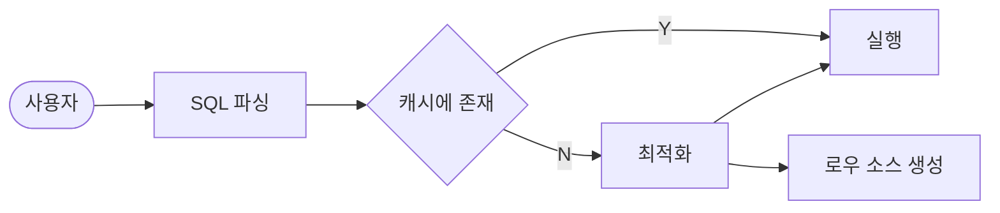

# 1. SQL 처리 과정과 I/O

- [SQL 최적화](#sql-최적화)
  - [SQL 최적화 과정](#sql-최적화-과정)
- [SQL 옵티마이저](#sql-옵티마이저)
- [실행계획과 비용](#실행계획과-비용)
- [옵티마이저 힌트](#옵티마이저-힌트)
- [소프트 파싱 vs 하드 파싱](#소프트-파싱-vs-하드-파싱)
- [바인드 변수의 중요성](#바인드-변수의-중요성)

***

## 1. SQL 파싱과 최적화

### SQL 최적화
- DBMS 내부에서 프로시저를 작성하고 컴하일해서 실행 가능한 상태로 만드는 전 과정

#### SQL 최적화 과정

> 1. SQL 파싱
> - 파싱 트리 생성
> - Syntax 체크
> - Semantic 체크
> 2. SQL 최적화
> - [SQL 옵티마이저](#sql-옵티마이저)가 수행
> 3. 로우 소스 생성
> - 옵티마이저가 선택한 실행경로를 실제 실행 가능한 코드 or 프로시저 형태로 포맷팅하는 단계
> - Row-Source Generator 에서 담당


### SQL 옵티마이저
- 사용자가 원하는 작업을 가장 효율적으로 수행할 수 있는 최적의 데이터 액세스 경로를 선택해 주는 DBMS 의 핵심 엔진

### 실행계획과 비용
- DBMS에서 SQL 실행경로를 미리볼 수 있음

> ✅ MySQL 의 경우 쿼리문 앞에 `EXPLAIN` 을 붙이면 확인 가능함

### 옵티마이저 힌트
- 주석 기호에 '+' 붙이기

```SQL
SELECT /*+ INDEX(A 고객_PK) */
    고객명, 연락처, 주소, 가입일시
FROM 고객 A
WHERE 고객ID = '000008'
```

#### 주의 사항
- ',' 는 힌트와 힌트 사이에 사용하면 안됨
- FROM 절 테이블명 앞에 ALIAS를 지정했다면, 힌트에도 반드시 ALIAS를 사용해야 함
- 테이블을 지정할 때 스키마명은 명시하면 안됨

&nbsp;
***

## 2. SQL 공유 및 재사용

### 소프트 파싱 vs 하드 파싱




- 소프트 파싱 : SQL을 캐시에서 찾아 곧바로 실행단계로 넘어가는 것
- 하드 파싱 : SQL을 캐시에서 찾는 데 실패해  최적화 및 로우 소스 생성 단계까지 모두 거치는 것


### 바인드 변수의 중요성

```SQL
SELECT * FROM CUSTOMER WHERE LOGIN_ID = 'oraking'
```
- 로그인 아이디가 달라지는대로 SQL 이 모두 [라이브러리 캐시](#라이브러리-캐시)에 저장될 것
  - **SQL은 이름이 따로 없고 SQL 자체가 이름이기 때문**

#### 바인드 변수 사용 시
```SQL
SELECT * FROM CUSTOMER WHERE LOGIN_ID = ?
```
- 로그인ID를 파라미터로 받는 프로시저 하나를 공유하면서 재사용이 가능해짐

&nbsp;

#### 라이브러리 캐시
- SQL 파싱, 최적화, 로우 소스 생성 과정을 거쳐 생성한 내부 프로시저를 반복 재사용할 수 있도록 캐싱해 두느 메모리 공간
- [SGA (System Global Area)](https://en.wikipedia.org/wiki/System_Global_Area) 구성요소