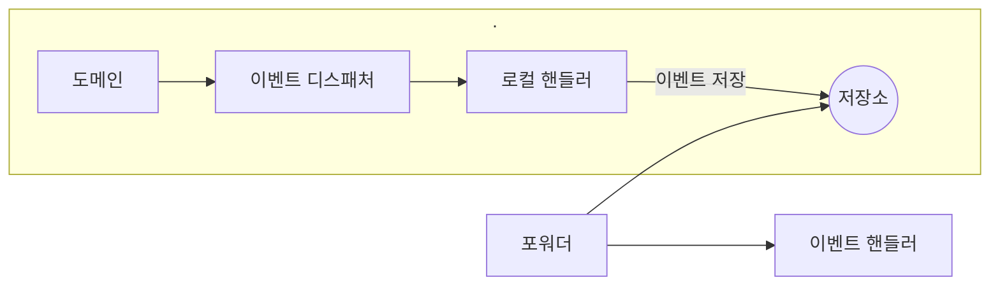

## 이벤트, 핸들러, 디스패쳐 구현

✅ Spring 에서 제공하는 기능을 중심으로 기록해둔 페이지임.
- [@EventListener](#이벤트-핸들러-예시)
- [@Async](#이벤트-비동기로-처리하기)
- [@Scheduled](#scheduled)

&nbsp;
***


<blockquote>
<h3>용어 정의</h3>
<ul>
<li> 이벤트 클래스: 이벤트를 표현함</li>
<li>이벤트 디스패쳐: 이벤트를 적절한 리스너(또는 핸들러)에게 전달하는 역할을 하는 컴포넌트 </li>
<li>이벤트 핸들러: 이벤트를 수신해서 처리함</li>
</ul>
</blockquote>

&nbsp;
***

### 이벤트 핸들러 예시

```java
@Service
public class OrderCanceledEventHandler {
    private RefundService refundService;
    
    public OrderCanceledEventHandler(RefundService refundServuce) {
        this.refundService = refundService;
    }
    
    @EventListener(OrderCanceledEvent.class)
    public void handle(OrderCanceledEvent event) {
        refundService.refund(event.getOrderNumber());
    }
}
```

- 이벤트 퍼블리셔가 `OrderCanceledEvent` 타입 객체를 전달하면, `OrderCanceledEvent.class` 값을 갖는 `@EventListener` 애너테이션을 붙인 메서드를 찾아 실행함.

&nbsp;
***

### 이벤트 비동기로 처리하기

#### 로컬 핸들러 비동기 실행 방법 

1. 메인 애플리케이션 클래스에 `@EnableAsync` 를 달아서 비동기 기능을 활성화함
```Java
@SpringBootApplication
@EnableSync
public class ShopApplication {
    ~~~
}
```
2. 이벤트 핸들러 메서드에 `@Async` 애너테이션을 붙임

```java
@Service
public class OrderCanceledEventHandler {
    private RefundService refundService;
    
    public OrderCanceledEventHandler(RefundService refundServuce) {
        this.refundService = refundService;
    }
    
    @Async
    @EventListener(OrderCanceledEvent.class)
    public void handle(OrderCanceledEvent event) {
        refundService.refund(event.getOrderNumber());
    }
}
```

&nbsp;
***

#### 이벤트 저장소를 이용한 비동기 처리 中 포워더 구현 방식



- 포워더는 일정 주기로 EventStore에서 이벤트를 읽어와 이벤트 핸들러에 전달하면 됨
- `getAndSend()` 메서드를 주기적으로 실행하기 위해 스프링의 `@Scheduled` 애너테이션 사용

&nbsp;

#### @Scheduled

- `initialDelay`
  - 애플리케이션 시작 후 초기 지연 시간을 설정

- `fixedDelay`
  - 고정된 주기로 작업을 실행 
  - 단위: 밀리초 (ms)
  - 이전 작업의 시작 시점부터 지정된 주기마다 실행됨
- `cron`
  - 크론 표현식을 사용하여 작업 실행 주기를 세밀하게 제어할 수 있음


```Java
@Scheduled(initialDelay = 1000L, fixedDelay = 1000L)
public void getAndSend() {
    long nextOffset = getNextOffset();
    List<EventEntry> events = eventStore.get(nextOffset, limitSize);
    if(!events.isEmpty()) {
        int processedCount = sendEvent(events);
        if (processedCount > 0) {
            saveNextOffset(nextOffset + processedCount);
        }
    }
}
```
