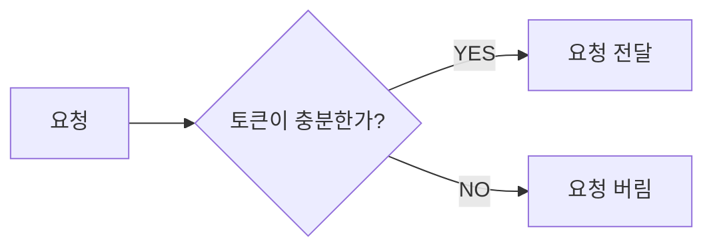

## 4. 처리율 제한 장치의 설계

### 처리율 제한 장치 위치

- 클라이언트 측 : 클라이언트 요청은 쉽게 위변조가 가능해서 별로
- 서버 측
- 미들웨어 측 : 클라우드 마이크로 서비스의 경우, 처리율 제한 장치는 보통 API Gateway에 구현되는데 이것이 미들웨어임

### 처리율 제한 알고리즘

### 토큰 버킷 알고리즘

- 토큰 버킷 : 저장된 용량을 갖는 컨테이너
  - 사전 설정된 양의 토큰이 주기적으로 채워짐
  - 버킷이 가득 차면 추가로 공급된 토큰은 버려짐
  - 각 요청을 처리될 때마다 하나의 토큰 사용

#### 인자
-  `버킷 크기`: 버킷에 담을 수 있는 토큰의 최대 개수
- `토큰 공급률`: 초당 몇 개의 토큰이 버킷에 공급되는가

#### 장점
- 구현이 쉬움
- 메모리 사용 측면에서도 효율적임
- 짧은 시간에 집중되는 트래픽도 처리 가능

#### 단점
- 인자 2개를 적절하게 튜닝하는 것이 까다로움

### 누출 버킷 알고리즘
- 토큰 버킷 알고리즘과 유사함
  - 차이점: 요청 처리율이 고정되어 있음
- 보통 **FIFO 큐**로 구현함

> #### 동작 원리
> - 요청이 도착하면 큐가 가득 차있는지 봄
> - 빈 자리가 있으면 큐에 요청 추가
> - 큐가 가득 차 있는 경우에는 새 요청을 버림
> - 지정된 시간마다 큐에서 요청을 꺼내어 처리함 ➡️ 고정 요청 처리율

#### 인자
- `버킷 크기` : 큐사이즈와 같은 값
- `처리율` : 지정된 시간 당 몇 개의 항목을 처리할지 지정하는 값

#### 장점
- 메모리 사용량 측면에서 효율적 ➡️ 큐의 크기가 제한되어 있기 때문
- 고정된 처리율을 갖고 있기 때문에 안정적 출력이 필요한 경우 적합함

#### 단점
- 단시간에 많은 트래픽이 몰리는 경우 최신 요청들이 버려짐
- 인자 튜닝이 까다로움

### 고정 윈도 카운터 알고리즘

> #### 동작 원리
> - 타임라인을 고정된 간격의 윈도로 나누고, 각 윈도마다 카운터를 붙임
> - 요청이 접수될 때마다 이 카운터의 값은 1씩 증가함
> - 카운터의 값이 사전의 설정됨 임계치에 도달하면 새로운 요청은 새 윈도가 열릴 때까지 버려짐

#### 장점
- 메모리 효율이 좋음
- 이해하기 쉬움
- 특정한 트래픽 패턴을 처리하기에 적합함

#### 단점
- 윈도 경계 부근에서 일시적으로 많은 트래픽이 몰려드는 경우, 처리 한도보다 많은 양의 처리를 요청

### 이동 윈도 로깅 알고리즘

> #### 동작 원리
> - 요청의 타임스탬프를 추적함
>   - 레디스의 정렬 집합 같은 캐시에 보관됨
> - 새 요청이 오면 만료된 타임스탬프는 제거함
> - 새 요청의 타임스탬프를 로그에 추가함
> - 로그의 크기 ≤ 허용치 ➡️ 시스템에 요청 전달
> - 로그의 크기 > 허용치 ➡️ 처리 거부

#### 장점
- 처리율 제한 메커니즘이 아주 정교함
- 허용되는 요청의 개수가 시스템의 처리율 한도를 넘지 않음

#### 단점
- 다량의 메모리를 사용함
  - 거부된 요청의 타임스탬프도 보관하기 때문 (왜지...?)

### 이동 윈도 카운터 알고리즘
- 고정 윈도 카운터 알고리즘 + 이동 윈도 로깅 알고리즘

> #### 동작 원리
> - 요청 개수 = 현재 1분간의 요청수 + 직전 1분 간의 요청수 x 이동 윈도와 직전 1분이 겹치는 비율
> - 요청 개수 > 제한한도 ➡️ 처리 거부

#### 장점
- 이전 시간대의 평균 처리율에 따라 현재 윈도의 상태를 계산하므로 짧은 시간에 몰리는 트래픽에도 잘 대응함
- 메모리 효율이 좋음

#### 단점
- 직전 시간대에 도착한 요청이 **균등하게 분포되어 있다고 가정한 상태에서 추정치를 계산하기 때문에** 다소 느슨함
  - 근데 실제로는 그렇게 심각하진 않다고 함
