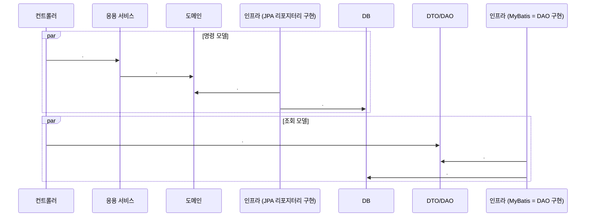

# CQRS

### 정의
- Command Query Responsibility Segregation
- `상태를 변경하는 명령을 위한 모델`과 `상태를 제공하는 조회를 위한 모델`을 분리하는 패턴

&nbsp;

### 장단점

#### 장점
- 명령 모델을 구현할 때 도메인 자체에 집중할 수 있음
- 조회 성능을 향상시키는 데 유리함
  - 조회 성능을 높이기 위한 코드가 명령 모델에 영향을 주지 않음

#### 단점
- 구현해야 할 코드가 더 많음
- 더 많은 구현 기술을 필요로 함
  - 명령 모델과 조회 모델을 다른 구현 기술을 이용해서 구현하기도 하고 경우에 따라 다른 저장소를 사용하기도 함
  - 데이터 동기화를 위해 메시징 시스템을 도입해야 할 수도 있음

***

### 웹과 CQRS
- 일반적인 웹 서비스는 상태를 변경하는 요청 < 상태를 조회하는 요청
- 조회 속도를 높이기 위해 별도 처리를 하고 있다면 명시적으로 명령 모델과 조회 모델을 구분하자.